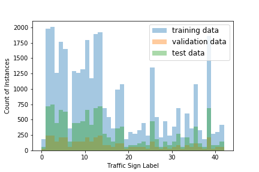
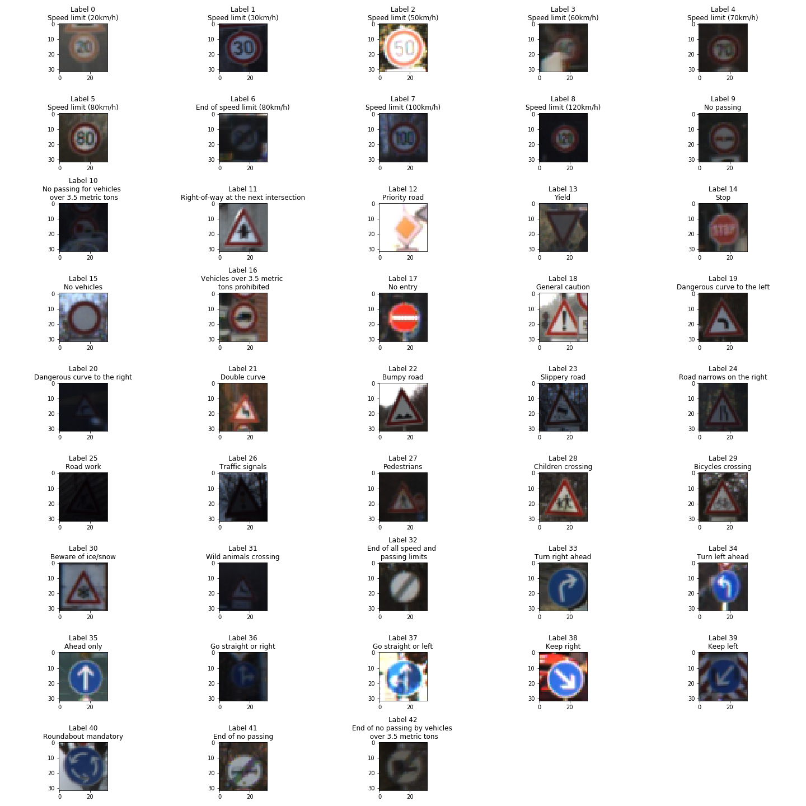
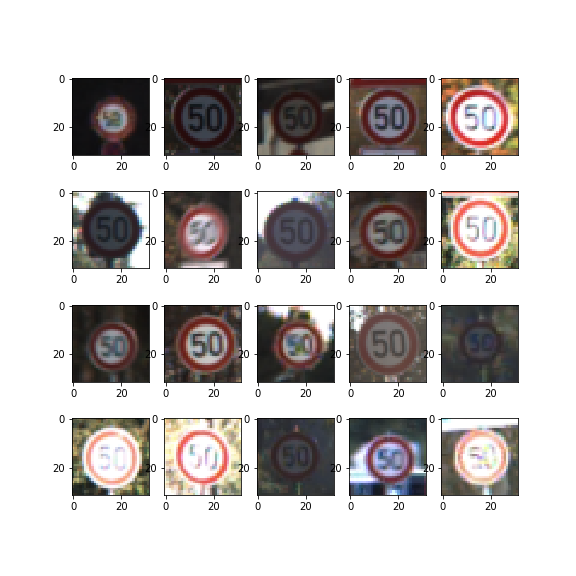
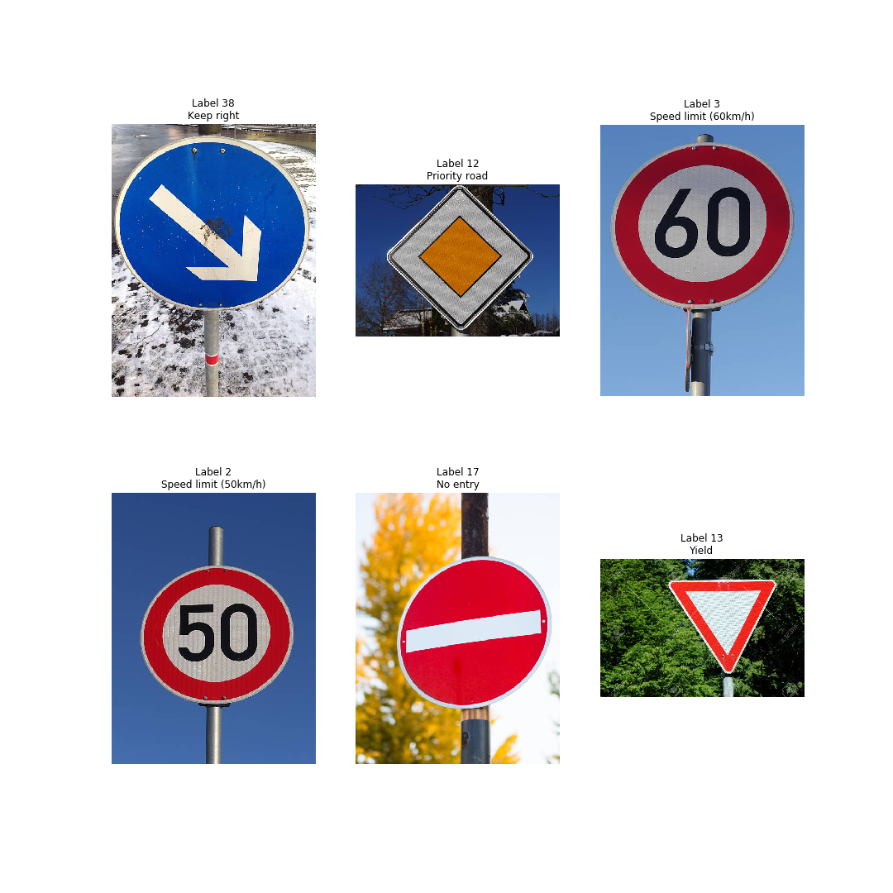
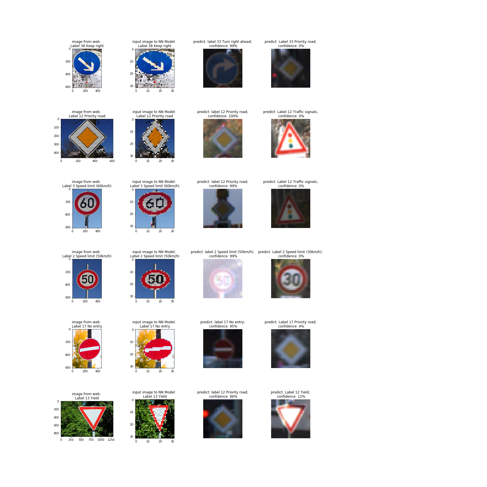

## Project: Build a Traffic Sign Classifier
Cristian Alberch
---

This application in Jupyter Notebook uses Machine Learning to predict the classification of a given traffic sign image.

The model uses a convolutional neural network based on the LeNet architecture in TensorFlow. The model is trained using a German traffic signs dataset, and tested against images of traffic signs taken randomly from the web.

The work is divided into sections: 

1. Data Set Summary & Exploration

2. Design and Test of Model Architecture

3. Testing the Model in 'Real-World' Environment

4. Results & Discussion

### 1. Data Set Summary & Exploration

I used the Numpy operations  summary statistics of the traffic
signs data set:

* The size of training set is 34,799.
* The size of the validation set is 4,410.
* The size of test set is 12,630.
* The shape of a traffic sign image is 32 x 32 x 3.
* The number of unique classes/labels in the data set is 43.

As there are 43 different labels to train, it is worth noting the distribution in the number of images per label in the training, validation and training datasets.



It can be observed that there is a large variance in the number of samples, where traffic sign label 2: "Speed limit (50km/h)" has the largest 
number of training samples (2010), whereas label 37 "Go straight or left" has the least number of training samples (180).

It is expected that images corresponding to labels with a small number of training samples will have a lower prediction accuracy.



In order to obtain a model that can be generalized, the variety of data is important. In this case, the training samples should include images with different sizes, shape, color, hue, and rotation.

A random sample of training images for label 2: "Speed limit (50km/h)" indicates a fairly well balanced training dataset. 



### 2. Design and Test of Model Architecture

#### 2.1 Pre-processing

Before feeding a training image to the neural network, pixel standardization for the input 3 image channels (RGB) was applied. This results in an input image with all 3-channels having mean = 0, and standard deviation = 1.

```
def process_img(img):
    pixels = asarray(img)    
    # convert from integers to floats
    pixels = pixels.astype('float32')
    # calculate per-channel means and standard deviations
    means = pixels.mean(axis=(0,1), dtype='float64')
    stds = pixels.std(axis=(0,1), dtype='float64')
    # per-channel standardization of pixels
    pixels = (pixels - means) / stds
    return pixels
```
#### 2.2 Le-Net modified architecure

The neural network is based on LeNet architecture and the following parameters modified to obtain the model with the highest validation accuracy:
- Learning rate: (0.0005 -> 0.002). 0.001 was selected.
- Batch sizes (32,64,128,256). 128 was selected.
- Dropout layer location (before, after ReLU). After ReLU wasa selected.
- Number of training epochs (upto 200). 40 was selected.

The neural network model consisted of the following layers:

| Layer         		|     Description	        					| 
|:---------------------:|:---------------------------------------------:| 
| Input         		| 32x32x3 RGB image   	                        |
|.......................|...............................................| 
| Convolution 3x3     	| 1x1 stride, 'VALID' padding, outputs 28x28x6 	|
| Activation			| ReLU											|
| Dropout               | 0.9 probability                               |
| Max pooling	      	| 2x2 stride,  'VALID' padding, outputs 14x14x6 |
|.......................|...............................................| 
| Convolution 3x3     	| 1x1 stride, 'VALID' padding, outputs 10x10x6 	|
| Activation			| ReLU											|
| Dropout               | 0.9 probability                               |
| Max pooling	      	| 2x2 stride,  'VALID' padding, outputs 5x5x16  |
|.......................|...............................................| 
| Flatten Input     	| outputs 400 x 1	                            |
|.......................|...............................................| 
| Fully Connected     	| outputs 400 x 1                              	|
|.......................|...............................................| 
| Fully Connected     	| outputs 120 x 1                             	|
|.......................|...............................................| 
| Fully Connected     	| outputs 43 labels                            	|
|.......................|...............................................| 


#### Training the model

Cross entropy was used to calculate the loss function and AdamOptimizer to optimize the loss function.

```
cross_entropy = tf.nn.softmax_cross_entropy_with_logits(labels=one_hot_y, logits=logits)
loss_operation = tf.reduce_mean(cross_entropy)
optimizer = tf.train.AdamOptimizer(learning_rate = rate)
training_operation = optimizer.minimize(loss_operation)
```

#### Testing the model

After the model was optimized several times verifying the accuracy against the validation data set, the final model was tested against the test data set.

My final model results were:
* validation set accuracy of 95.3 
* test set accuracy of 93.7


### 3. Testing the Model in 'Real-World' Environment

The following images of traffic signs were downloaded from the web in .jpeg format.



The jpeg images were:
- Reduced to size 32 x 32 x 3.
- Saved in .png format.
- Normalized to mean of 0 and standard deviation of 1.0.
- Fed into the neural network.

The image processing and model predictions are shown in table below with the corresponding prediction confidence.



1. "Turn right" is incorrectly classified. However, the prediction result does get the main image characteristics correct (i.e. it's blue with a white arrow pointing to the right).

2. "Priority Road" is correctly classified. This image should be easy to classify as it is very distint to all the other traffic symbols.

3. "Speed limit (60km/h)" is incorrectly classified. This could be due to the sign post confusing the image.

4. "Speed limit (50km/h)" is correctly classified. This traffic sign is one of the most heavily represented in the training data set.

5. "No entry" is correctly classified. The strong red background and circular shape makes it easy to distinguish.

6. "Yield" is incorrectly classified as the first prediction. However, it is correctly classified with 17% confidence in the second prediction. The straight edges with white surroundings appear to be a factor in the prediction.

### 4. Results & Discussion

The model has a high accuracy for the training dataset provided (94%) but a much lower accuracy when it is fed random images of traffic signs from the web. The model could be trained to generalize better by:

1. Increase the training dataset by applying transformations, such as: adding random noise, adjusting color saturation, hue, rotation, viewing angle.

2. The images when reduced to 32 x 32 size are not very clear. Increasing the resolution of the image would improve the accuracy albeit resulting in a larger neural network requiring more computational resources.

 
  
   
Acknowledgments:

The .csv files containing data provided by Udacity from German Traffic dataset [German Traffic Sign Dataset](http://benchmark.ini.rub.de/?section=gtsrb&subsection=dataset). The starter code was provided by Udacity.

Authors: Cristian Alberch https://github.com/cristiandatum

License: This project is licensed under the MIT License. Feel free to use the code in the Jupyter Notebook as you like.

